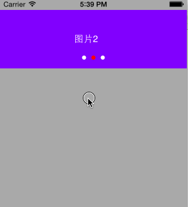

# KFImageCarouselView

[](https://travis-ci.org/K6F/KFImageCarouselView)
[](http://cocoapods.org/pods/KFImageCarouselView)
[](http://cocoapods.org/pods/KFImageCarouselView)
[](http://cocoapods.org/pods/KFImageCarouselView)


## Usage

To run the example project, clone the repo, and run `pod install` from the Example directory first.

### Storyboard
#### step one
In storyboard, drag an UIView into ViewController, setup constraints, change it's class to **KFImageCarouseView**


#### step two
In ViewController, Input **KFImageCarouseView.h**  

```objective-c
#import "KFImageCarouseView.h"
```
And create an IBOutlet of view.

```objective-c
@property (weak, nonatomic) IBOutlet KFImageCarouselView *imageCarouseView;
```

#### step three
Use **KFImageCarouselViewDataSource** And **KFImageCarouselViewDelegate** to control.


### Property

#### kfDisplayDuration
Duration for timer to change image;
Duration must more than or equal 1 second, or would be ignored.

#### pageControl
UIPageControl

#### dataSource
dataSource with protocol **KFImageCarouselViewDataSource**

```objective-c
@protocol KFImageCarouselViewDataSource <NSObject>
/**
 *  @author K6F, 2015-22[3]
 *
 *  @return count of images
 */
- (NSInteger)kf_countOfImages;
/**
 *  @author K6F, 2015-22[3]
 *
 *  Load image to imageView.
 *  You can use SDWebImage or NSData to load image from Internet.
 *  Or just load local image with path or name.
 *
 *  @param imageView UIImageView to Show
 *  @param index     index of image
 */
- (void)kf_imageView:(UIImageView *)imageView loadImageAtIndex:(NSInteger)index;
@end
```

#### delegate
delegate with protocol ** KFImageCarouselViewDelegate**

```objective-c
@protocol KFImageCarouselViewDelegate <NSObject>
/**
 *  @author K6F, 2015-22[3]
 *
 *  Tap action.
 *
 *  @param index Index of image which is tapped
 */
- (void)kf_didTapImageAtIndex:(NSInteger)index;
@end
```

### Method
#### reloadData
Reload imageView throw datasource;

## Requirements

###### iOS >= 7.0

## Installation

KFImageCarouselView is available through [CocoaPods](http://cocoapods.org). To install
it, simply add the following line to your Podfile:

```ruby
pod "KFImageCarouselView"
```

## Author

K6F, Fan.Khiyuan@gmail.com

## License

KFImageCarouselView is available under the MIT license. See the LICENSE file for more info.
